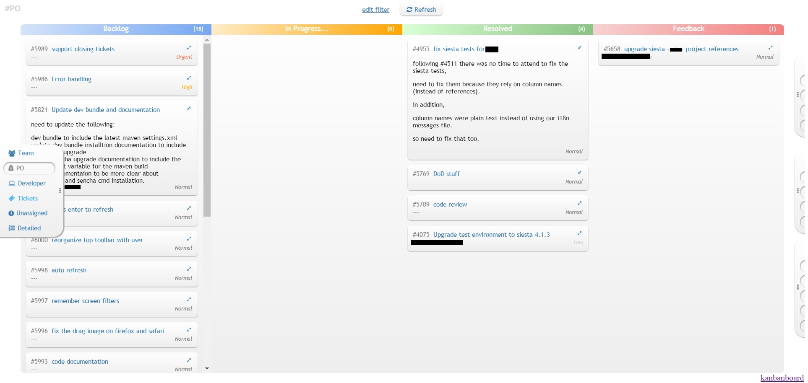

# Kanbanboard

Kanbanboard integrates with [Redmine](http://www.redmine.org/) and provides a better View and better UI experience.

Kanbanboard is based on:

* [Backbone](http://backbonejs.org/)
* [Underscode](http://underscorejs.org/)
* [JQuery](https://jquery.com/)
* [CoffeeScript](http://coffeescript.org/)
* [NodeJS](https://nodejs.org/en/)
* [Express](https://expressjs.com/)
* [Grunt](https://gruntjs.com/)
* [Browserify](http://browserify.org/)
* [Less](http://lesscss.org/)
* [FontAwesome](http://fontawesome.io/)

Take a look at the wonderful examples of CoffeesScript and Backbone with advanced stylesheets, responsive design without any framework interrupting and a super lightweight and fast performing application.

Kanbanboard is built with grunt and includes many grunt modules and features.
Survey the Gruntfile.coffee for interesting examples...

Kanbanboard is running on a Node Express server and provides a server proxy module for Redmine.

# Kanbanboard installation notes

Before installation you must have nodejs installed, with bower and grunt-cli.

To install bower and grunt globally run the following commands:
```
npm install -g bower
npm install -g grunt-cli
```

To build the project the first time, run the following commands in the reposiroty's base directory:
```
npm install
bower install
grunt
```

Building the project consists of running `grunt` or `grunt distribution`

Do not forget to delete `build` and `_temp` directories before building a distribution version.


To run the project go to `build` directory and run `npm install` and then `npm start`

Make sure you have a `kanbanboard.properties` file in build folder with a `redmine.api.url` property that points to your redmine host and a `kanbanboard.http.port` property with the http port for the web server.
For example:
```
redmine.api.url=my.redmine.host
kanbanboard.http.port=9090
```

Then go to `localhost:9090` in your browser.


When developing you can run `grunt watch` and it will automatically transpile the coffee and less files when you make changes to the project.


### To get your Redmine API Key:  
- Login to redmine
- Go to my account,  
- and on the right panel, press `Show API Key`
- Copy paste it to the key field in Kanbanboard

Your'e all set, click `refresh` and you'll have your tickets.


## How does it look?

Kanbanboard has a simple columns design and sliding menus.  
Features:
- Sliding Navigation on the left
- Sliding Filters on the right
- Removing columns
- Saving queries and the API key in localstorage so you dont have to copy paste it all the time
- Single refresh button to load your queries
- Tickets expand and collapse to read the description
- Drag and Drop tickets to change their status


